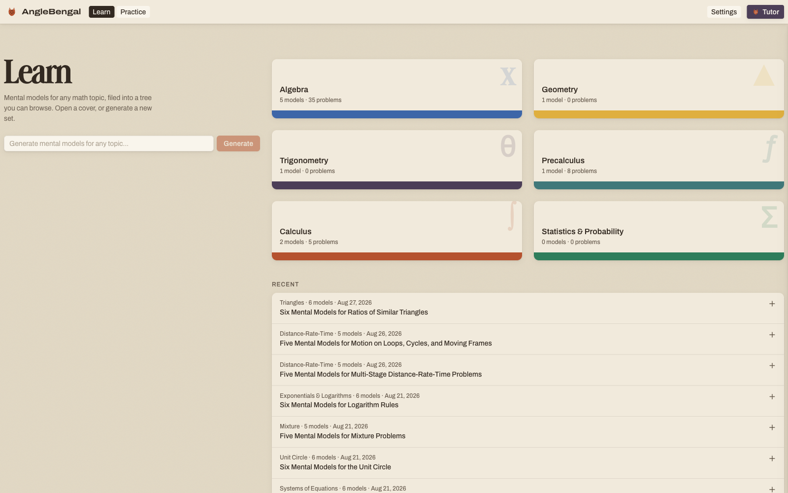

# AngleBengal

A personal math tutor that teaches **mental models** instead of procedures, then tells you exactly where you failed in the process when you get a problem wrong.

Type any math topic and AngleBengal writes a full mental model document for it, filed into a taxonomy you can browse. It generates practice problems tied to those models and verifies each one by solving it twice, independently, before you ever see it. When you answer wrong, the diagnosis names the specific model that failed and links you to the section of your own notes that explains why. A tutor chat reads your library and speaks in its vocabulary, and a graph paper sketchpad turns your handwritten working into clean typed math.

[MIT](LICENSE). Copyright (c) 2026 Myles Magee.
