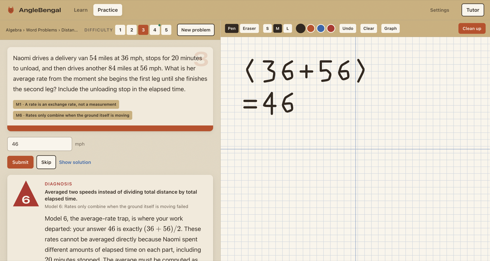
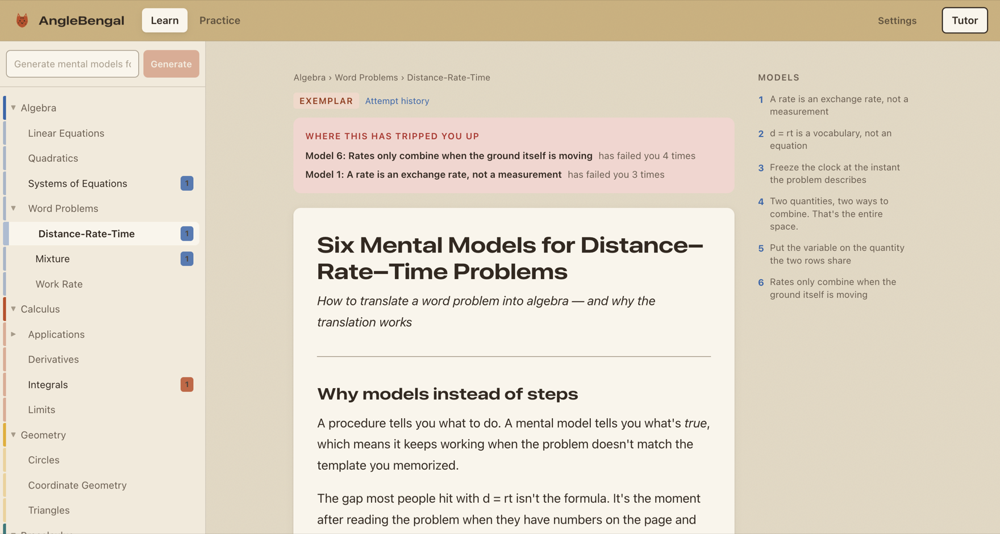

# AngleBengal

A personal math tutor that teaches **mental models** instead of procedures, then tells you which model failed when you get a problem wrong.

Most tutoring apps mark an answer incorrect and show you the solution. This one says: *"you averaged 36 and 56 to get 46, and that is Model 6, the average-rate trap"*, then links you straight to the section of your own notes that explains why.



## Why it works this way

The premise is that the gap in math learning is **translation, not computation**. Students who fail word problems usually can do the arithmetic. What they cannot do is look at a paragraph and know what to write down.

Procedures do not close that gap, because a procedure only fires when the problem matches the template you memorized. A mental model does, because it tells you what is *true* about a class of problems. So the app is built around three things that a flashcard app is not:

- **Documents describe models, not steps.** Each one gives the reframe, why it is true, what errors it prevents, worked examples, and a diagnostic table mapping observable mistakes to the model that caused them.
- **Every problem is solved twice.** The generator writes a problem and its answer. A second, independent pass then solves it from the statement alone, never seeing the first answer. They have to agree or the problem is discarded. You are never shown a problem the app has not verified.
- **A wrong answer is attributed, or not at all.** The diagnosis names one model and shows the moment your work left it. When it is not confident, it says nothing rather than guessing, because a confidently wrong diagnosis is worse than none.

## Quick start

Requires **Node 20.9 or newer** (built on 24.1) and an OpenAI API key.

```bash
git clone https://github.com/MylesM18/AngleBengal.git
cd AngleBengal
npm install
```

Add your key. `DATABASE_URL` already ships in `.env`, so this is the only thing you need to set:

```bash
echo 'OPENAI_API_KEY=sk-your-key-here' > .env.local
```

Create the database and load the starter taxonomy plus the exemplar document:

```bash
npx prisma migrate dev
npx prisma db seed
npm run dev
```

Open <http://localhost:3000/learn>. You will land on a 31-topic tree with one document already in it: six mental models for distance-rate-time problems. That document is the quality bar every generated document is measured against.

To try the loop end to end: type a topic like `related rates` into the sidebar input, wait about two minutes, then open **Practice**, generate five problems, and answer one wrong on purpose.

## The three surfaces

**Learn** holds your library. Type any math topic and the app files it into the taxonomy (creating nodes only when nothing fits) and writes a full model document for it. Documents you keep missing show their miss counts at the top: "Model 6 has failed you 4 times", linked to those exact attempts.



**Practice** serves verified problems tagged to the models they exercise, with a graph-paper sketchpad beside them. Write your working by hand, hit **Clean up**, and it comes back as typed math you can insert into the answer box. Your handwriting rides along with the attempt, so the diagnosis can point at the line where things went wrong.

**Tutor** is a chat drawer available from both tabs. It reads your documents and speaks in their vocabulary, naming models by number. While a problem is open it will not hand over the answer: ask directly and it offers the next single step instead. Once you solve or reveal the problem, that restraint drops and it will walk the whole solution.

## Commands

```bash
npm run dev          # dev server
npm run build        # production build
npm run lint         # eslint
npm run typecheck    # tsc --noEmit
npx prisma migrate dev
npx prisma db seed   # taxonomy + the DRT exemplar
```

## How it is built

Next.js App Router with TypeScript in strict mode, Tailwind v4, Prisma over SQLite, and KaTeX for math. Every OpenAI call goes through one server-side wrapper that handles model selection, JSON-schema responses, zod validation, a single retry, and token logging. The key never reaches the browser: the client module is marked `server-only`, so importing it from a component is a build error rather than a leak.

`/settings` shows what the app has spent, in tokens, grouped by prompt.

The design is a "swatch book": every surface is a sheet of paper, structure comes from how paper behaves (sheets stack, get die-cut, carry a colored band), and every color, radius and shadow comes from a token. The diagnosis card is the one place the die-cut is used literally, because it is the moment the app exists for.

Full specifications live in [`docs/`](docs/) (product, architecture, data model, API, AI prompts, UI, build plan, and design theme). Judgment calls made where those specs were ambiguous or self-contradictory are recorded in [`DECISIONS.md`](DECISIONS.md).

## Scope

This is a single-user, local-first application. There is no authentication, no multi-tenancy, and no deployment pipeline, by design. SQLite is the development database and the Prisma schema is kept Postgres-compatible so moving is a connection-string change.

Deliberately not built: spaced repetition, mobile layouts, real-time handwriting recognition, and PDF export.

## A note on the exemplar

`content/exemplars/drt-mental-models.md` is the few-shot example injected into every generation, and it is the standard everything else is held to. It is also the one file in the repo that breaks two of the rules it is used to enforce: it writes math as code spans rather than LaTeX, and it uses em-dashes. Both are handled by explicitly telling the model where the example departs from the rules, which is the difference between generation that passes structural validation and generation that loops on it. See `DECISIONS.md` D-001 and D-009.

## License

No license has been chosen yet, so default copyright applies: all rights reserved. Add a `LICENSE` file if you want to change that.
